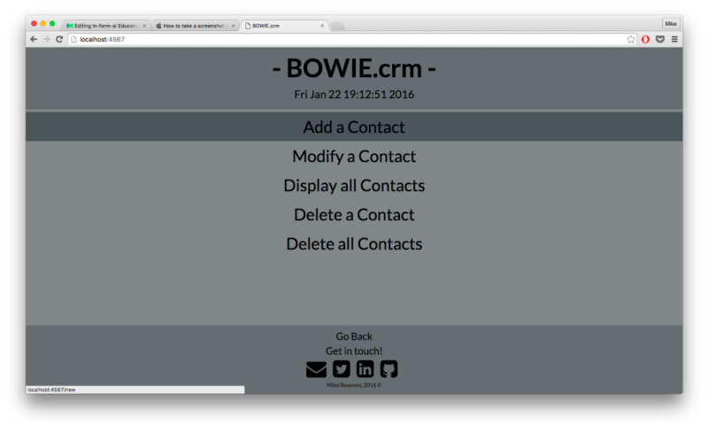

And thus ends week two at Bitmaker. Another week of knowledge and information
endlessly being thrown at us, like a child throwing spaghetti at the wall <!--
endexcerpt --> (Not sure that’s real imagery, but I’m into it). The past week
was largely spent wrestling our previously mentioned command-line address book
program into a fully-fledged, database-backed, web app.

From this..

To this. 

This week was huge. Turns out building a web app is a pretty big undertaking,
and we covered it all. Creating and running a web server, writing the actual
HTML and CSS required to display the page, creating the forms to add and edit
contacts, linking the forms to the server in the right order, so that the right
information gets passed to the right places, and finally linking the whole thing
to a database. But, at the end of it all, I’m left with a web app that a) works,
and b) doesn’t look objectively terrible, like most websites I’ve tried to make.
On the whole, it was tough, but I’m pretty pumped about how it turned out. The
next step for this app is trying to implement a search function. I’m not
entirely sure how to go about that, but luckily every tool I used to build the
app has huge, detailed, and easily accessible documentation online.
[This](http://ruby-doc.org) is the official site for the Ruby documentation.
Browse at your own peril, but you might find it interesting to poke around and
see if you can decipher any of it.

A classmate told me last week that he’d figured out the structure of the
program. They give us a task, but don’t really explain all the tools or best
techniques to accomplish the task. We struggle along, succeed (or don’t), and
then the next day in class, they introduce things that would’ve made the
previous day’s project a lot easier. At least once a day in class I seem to have
this giant “Aha!” moment, where the instructor tells us something that would’ve
been super helpful for the previous assignment, or points out a feature of
whatever the framework of the day is, that makes a particularly menial,
repetitive task so much more straightforward.

I suppose that’s one of the great benefits of using open-source languages and
resources to write code. They’ve got huge, well-documented resources available,
and loads of people (real users) continuously add to the pool of tools. Take
Ruby itself. The actual code that the language is written in, a language called
C, is entirely available [here](http://github.com/ruby/ruby), and if you take a
look at the dates on the right side of the page, you can see that (at the moment
I’m writing), the language itself was last edited 42 minutes ago. These
programming languages are living, evolving creatures, which is a really exciting
thing. Think a particular language could use a little package to do something
simple automatically? Go ahead and write it. Is there a functionality that
doesn’t exist in the language, but you wish it did? Add it in. I was amazed at
how much stuff online is actually open-source, and how willing people are to
donate their time and energy to maintaining these massive projects. It really is
a community, tied together by the common use of Ruby. Or
[Python](http://www.python.org). Or [Swift](https://github.com/apple/swift). Or
whatever.

On Monday, we get into the meat of the course. [Rails](http://rubyonrails.org)
is a Ruby framework (also [open source](http://github.com/rails/rails)).
Basically, it’s a bunch of pre-written Ruby that you can download and use as you
please. It basically does a bunch of the legwork of getting a functional app up
and running. Setting up servers, organizing file directories, and probably more
fun stuff that I haven’t learned yet. It’s widely used (Twitter, Shopify,
Groupon, Airbnb) and super powerful. I figure I’ll have a bunch more “Aha!”
moments when I see things that I’ve been typing manually and repetitively that
can be automated by Rails. Anyways, Rails is a topic for another post. Off to
try and implement that search function!

Happy Weekend
